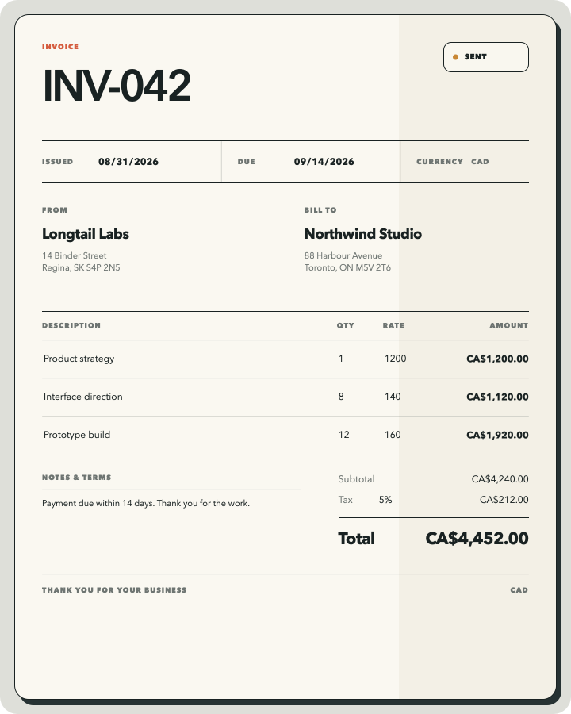
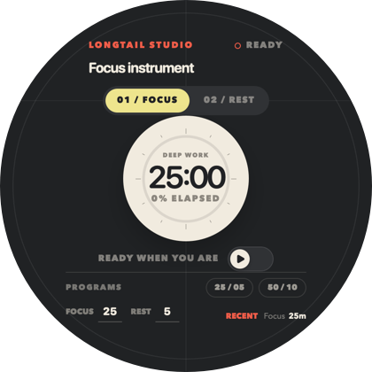

# hitSlop

> Tiny apps. Big ideas. Your data stays yours.

hitSlop is a native home for small, personal, local-first web apps. Each
`.slop` is a document you can open, move, duplicate, share, commit, and keep—not
an account you have to maintain. The app owns its interface; the host owns
durable JSON, SQLite, named media, previews, export, and native window behavior.

<p align="center">
  
  
</p>

A slop can feel like **paper** (invoice, recipe, résumé), an **instrument**
(timer, picker, mixer), or a **skin** (a tiny object with its own silhouette).
Those are design directions, not runtime frameworks: the package contract is
plain HTML plus host data.

## Same file, same truth

Slops are designed for bidirectional editing. Change a value in the rendered
interface and its local store updates. Change the JSON or SQLite data on disk
and an open slop can follow the new revision. You and your AI can work on the
same ordinary local data without a proprietary cloud record in the middle.

Start from an existing slop and fork it into the tool you actually want. Ask
your AI to change the design, add a field, or use a different store; keep the
source project and build another portable `.slop`.

Publishing does not require hosting a web app, provisioning a database, or
building authentication. The catalog receives a signed, source-free runtime
artifact, while personal document stores stay out of the published template.
When the result—not the app—is what you need to share, export the current
document as a high-resolution PNG or a PDF with selectable text and vector
output.

## Make one

Bun and the Svelte template are the supported v1 authoring path:

```sh
bunx @hitslop/cli init my-tiny-app
cd my-tiny-app
bun install
bun run dev
bun run build
bun run register
# when it is ready for the public catalog:
bun run publish
```

The CLI scaffolds a Svelte source project, previews it with disposable in-memory
data, and builds a source-free `dist/<slug>.slop`. The runtime remains framework-neutral;
the React adapter is archived while supported authoring focuses on Svelte.

Read [Authoring a slop](docs/authoring.md) for the full workflow and
[Designing tiny software](docs/presentation.md) for object families,
transparent backgrounds, resizing, icon art, and export-safe layouts.

## What is inside a `.slop`?

```text
tiny-app.slop/
├── manifest.json
├── app.html
├── data.schema.json            optional, generated
├── assets/                    optional, immutable
├── .agents/skills/hitslop-document/
├── stores/                    optional, host-owned document data
│   ├── data.json
│   ├── data.sqlite
│   ├── media/
│   └── theme.css
└── QuickLook/
    ├── Preview.png
    └── Icon.png
```

Authored templates and published artifacts never contain source, dependencies,
build caches, seed stores, editable stylesheets, SQLite sidecars, or Finder's
local `Icon\r` metadata. Storage is implicit: use JSON, SQLite, named media,
any combination, or none. See [Package format](docs/package-format.md) and
[Storage](docs/storage.md).

## The system at a glance

- `apps/apple` — the macOS/iOS document host, catalog UI, Quick Look, export,
  local/iCloud coordination, and the native capture CLI.
- `apps/landing` — the static Astro site served at `hitslop.com`.
- `apps/firebase` — Firebase Functions, Firestore, Storage, Hosting, and catalog
  rules for publishing and discovery.
- `packages/cli` — create, validate, preview, build, register, sign, and publish.
- `packages/runtime` — the framework-neutral browser bridge.
- `packages/svelte` — reactive adapters and optional icon/export components.
- `packages/schema` — authoritative TypeBox schemas and generated Swift/JSON
  boundaries.
- `examples/slops` — maintained source examples; `archive/templates` is
  inventoried prior art, never a runtime package.

The hosted catalog is the convenient default. The protocol and services are
open, and [self-hosting](docs/self-hosting.md) is documented.

## Work on hitSlop

```sh
bun install
bun run release:check
```

That first-launch gate checks generated schemas, the public TypeScript/Svelte
packages, clean-room npm tarballs, Firebase package ingestion, documentation and
tracked-file hygiene, and the Swift package. Older examples have the separate
`bun run examples:check` gate while they are intentionally converted to v1. If
you are changing platform TypeBox schemas, run `bun run schema:generate` first.

Start with the [documentation map](docs/README.md), then read
[Architecture](docs/architecture.md), [Repository guide](docs/repository.md),
and [Contributing](CONTRIBUTING.md).

The macOS app is at `1.0.1`. The iOS app and public npm packages are at
`0.1.0` while their APIs settle.

## License

MIT © 2026 hitSlop contributors. See [LICENSE](LICENSE) and
[third-party notices](THIRD_PARTY_NOTICES.md).
