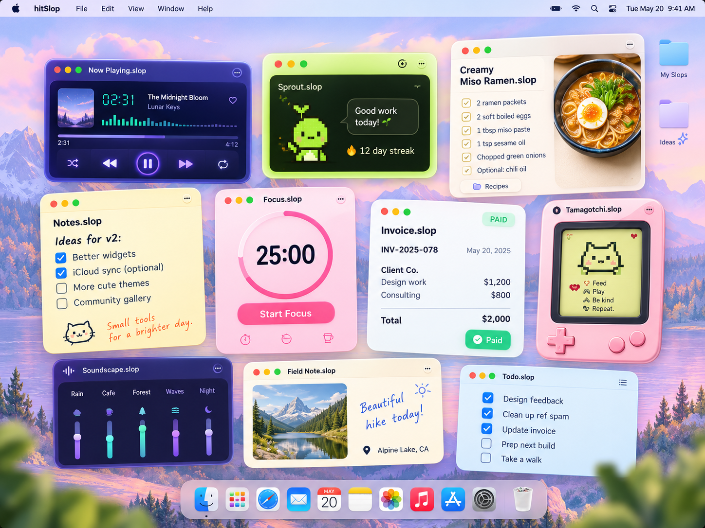

# hitSlop

**Tiny apps. Big personality.**

Build mini apps with Svelte and your favorite AI coding agent: interactive docs, useful little tools, and weird desktop experiments. Describe what you want, make it yours, and give it a home on your Mac.

Your AI can work with the data, too. Edits flow both ways: changes you make in the app are available to your agent, and changes it makes through the document CLI appear in the app. Each `.slop` keeps the interface and saved work together in one portable package. Local apps work offline, and you can send a copy to a friend with hitSlop. Tiny software worth making, keeping, and passing around.

[Download for Mac](https://github.com/hitslop/hitslop/releases/latest/download/hitSlop.dmg) · [Explore the website](https://hitslop.com) · [Make your first slop](#make-your-own-with-an-agent) · [Docs](docs/README.md)

macOS 14+ · Apple silicon · No account required

<p align="center">
  
</p>

## Small enough to be yours

Sometimes you just want a packing list for one trip. A timer that looks like a tomato. A recipe card covered in your own notes. A tiny pond to stare at between meetings.

Those are good reasons to make software.

hitSlop is built for tools with one clear job and a little character. Start with a template, or ask your coding agent to make the thing you keep wishing existed. Give it the fields you need, the colors you like, and a window that fits the job. It can feel like a sheet of paper, a pocket calculator, or something you found in an old arcade.

The useful part is making it yours. A weekly planner follows *your* week. An invoice looks like *your* work, because it is. A checklist is exactly as small as the task deserves.

## What belongs on your desktop?

These are real source examples you can explore and build:

| A little help | Something to send | Just for the love of the game |
| --- | --- | --- |
| [Quick Checklist](examples/slops/quick-checklist) — get it out of your head | [Invoice](examples/slops/invoice) — get paid | [Pixel Art](examples/slops/pixel-art) — one more pixel |
| [Focus Timer](examples/slops/focus-timer) — make room to concentrate | [Recipe](examples/slops/recipe) — keep the good ones | [Koi Pond](examples/slops/koi-pond) — take a tiny break |
| [Small Expenses](examples/slops/small-expenses) — remember where it went | [Résumé](examples/slops/resume) — introduce yourself | [Wordle](examples/slops/wordle) — five letters, a little obsession |

[Browse all the examples →](examples/slops)

## Keep the app. Keep the work.

- **Local by default.** Your documents live on your Mac. No account, server, or database setup needed to use a local slop.
- **A file you can keep.** The interface, saved data, and imported attachments travel together. Close a document before moving or copying it in Finder.
- **Pass it around.** Send a friend a clean template or a copy of a finished document. Zip the closed `.slop` package for transfer; they'll need a compatible hitSlop Mac app. [How to share a slop](apps/landing/src/content/docs/docs/guides/build-and-share.mdx#share-a-template-or-a-document).
- **You and your agent.** Use the app yourself or have an agent edit its data through the document CLI. Both work with the same document. Installed document editing needs no Node or Bun.
- **Ready to leave the desktop.** Export a PNG or PDF: send the invoice, print the recipe, or drop your plan into a message.
- **Room for personality.** Each app owns its design. Change a document's supported theme colors, or change the source to make a whole new tool.

## Make your own with an agent

Bring a small idea, Bun, and your favorite coding agent. Setup asks what your slop should do and who made it, then offers to launch the agent CLI you choose. The starter includes a working Svelte checklist, your `BRIEF.md`, `AGENTS.md`, and authoring/design skills.

Use Bun 1.4.2 or newer and the matching hitSlop Mac app, installed in `/Applications` or `~/Applications` for native builds and registration.

**1. Give your idea a folder.**

```sh
bunx @hitslop/cli@1.1.0 init weekend-kit
cd weekend-kit
bun install
```

**2. Let your chosen agent build it.**

At the end of setup, choose a detected agent, **Other CLI…** to enter another installed tool, or **Finish without launching**. The agent opens in the project with your brief and hitSlop guidance. Use `--yes` and `--brief 'What to build'` when an agent or script is already creating the project; this never launches another agent.

You can also open the folder in your agent yourself. Try this:

> Read AGENTS.md, manifest.json, and the authoring/design skills in .agents/skills first. Turn this starter into “Weekend Kit,” a packing list for short trips. Let me add items, group them by bag, check them off, and see how many are left. Make it feel like a pocket field notebook: warm paper, forest-green ink, and comfortable checkboxes. Include a clean printable packing list for PNG/PDF export. Keep it small, use hitSlop's document APIs for saved data, and run the project checks when you're done.

Then get specific: “Make the checkboxes bigger.” “Add a toiletries section.” “Let me rename the trip.” Small requests make it easy to see whether the tool is becoming something you'll actually use.

**3. Try it, then put it on your desktop.**

```sh
bun run dev
```

The browser preview uses disposable data; refreshing resets it. Restart the dev command after source changes. When it feels right, stop the preview and run:

```sh
bun run check     # Check your Svelte and TypeScript code
bun run build     # Package your app as dist/weekend-kit.slop
bun run register  # Add the template to hitSlop's local catalog
```

Build creates `dist/weekend-kit.slop`. Register adds the template to your local catalog. Open hitSlop, choose it under **Templates**, and select **Create** to make your own writable document. Add a few items, close and reopen it, then try a PNG or PDF export.

You can also zip up `dist/weekend-kit.slop` and send it to a friend. They just unzip it and open the `.slop` with hitSlop on their Mac. The app and its starting content are included; your personal saved data stays in your document.

You keep the source and the finished app. Make another version whenever you like; existing documents keep the app version they were created with.

[Follow the full tutorial](apps/landing/src/content/docs/docs/getting-started.mdx) · [Authoring guide](docs/guides/authoring.md) · [Edit a document with your agent](apps/landing/src/content/docs/docs/guides/edit-installed-data.mdx)

## A whole slop, from scratch

Want to see what your agent is building? Here's **Tiny Wins**: a name, a counter, and a button for giving yourself a little credit. Its window, icon, and export all read the same document.

With the same Bun and Mac app setup above, create a fresh starter:

```sh
bunx @hitslop/cli@1.1.0 init tiny-wins
cd tiny-wins
bun install
```

Replace the following starter files. Keep the generated `package.json` and `tsconfig.json`.

### 1. Give it a name and a window

`manifest.json` describes the app, including its starting window size.

```json
{
  "$schema": "https://api.hitslop.com/schemas/v1/manifest.schema.json",
  "runtime": "hitslop-v1",
  "slug": "tiny-wins",
  "title": "Tiny Wins",
  "description": "A little credit for the things you get done.",
  "author": { "name": "You" },
  "categories": ["personal"],
  "presentation": { "width": 360, "height": 360 }
}
```

### 2. Say what it remembers

`schema.ts` defines the saved fields. Text is editable; a counter supports increments.

```ts
import { defineDocument, s } from "@hitslop/document";

export default defineDocument({
  title: s.text(),
  wins: s.counter(),
});
```

`initial.ts` supplies the starting values for **new** documents. Changing it later doesn't overwrite someone's saved wins.

```ts
export default { title: "Tiny wins today", wins: 0 };
```

### 3. Pick its colors

`theme.ts` declares tokens available as CSS variables. These colors are shared by the window, icon, and export. Your agent can override them at runtime through hitSlop's theme commands, even while the document is open. No rebuild needed. Overrides stay with that document; the template's defaults stay intact.

```ts
import { defineTheme } from "@hitslop/document/theme";

export default defineTheme({
  surface: "#fff7e6",
  ink: "#382d24",
  accent: "#28634b",
});
```

### 4. Build the app, icon, and export together

`App.svelte` is the whole interface. Read from `doc.current`, write through `doc.fields`, and let hitSlop handle saving.

```svelte
<script lang="ts">
  import { Slop, useDocument, bindText } from "@hitslop/document/svelte";
  import schema from "./schema";

  const doc = useDocument(schema);
</script>

<Slop>
  <main class="wins-card">
    <input aria-label="Counter title" use:bindText={doc.fields.title} />
    <p class="wins-number" aria-live="polite">{doc.current.wins}</p>
    <button onclick={() => doc.fields.wins.increment()}>A little win +1</button>
  </main>

  {#snippet icon()}
    <div class="wins-icon">{doc.current.wins}</div>
  {/snippet}

  {#snippet exportView()}
    <article class="wins-card">
      <h1>{doc.current.title}</h1>
      <p class="wins-number">{doc.current.wins}</p>
      <p>Little things add up.</p>
    </article>
  {/snippet}
</Slop>
```

Click three times and the window shows **3**. Export a PNG or PDF and it shows **3**, with your current title and no editing controls. The icon snippet renders **3** too when hitSlop captures the document's icon. Snippets render on demand from current data; there's no separate icon counter or export state to keep in sync. Build/register generate the template artwork from starting values, and closing a writable document refreshes its Finder preview and icon.

Give all three views a little warmth in `styles.css`:

```css
* { box-sizing: border-box; }
body { font-family: system-ui, sans-serif; color: var(--slop-ink); }
.wins-card {
  padding: 28px;
  text-align: center;
  overflow-wrap: anywhere;
  background: var(--slop-surface);
}
main.wins-card { min-height: 100%; }
.wins-card input {
  width: 100%; padding: 10px; border: 0; border-radius: 8px;
  font: inherit; color: inherit; background: transparent; text-align: center;
}
.wins-card h1 { margin: 0; font-size: 24px; }
.wins-number { margin: 20px 0; font-size: 72px; font-weight: 800; }
.wins-card button {
  min-height: 44px; padding: 12px 20px; border: 0; border-radius: 12px;
  font: inherit; color: var(--slop-surface); background: var(--slop-accent);
  cursor: pointer;
}
.wins-card :focus-visible { outline: 3px solid var(--slop-accent); outline-offset: 4px; }
.wins-icon {
  width: 440px; height: 440px; border-radius: 100px;
  display: grid; place-items: center; font-size: 150px; font-weight: 800;
  color: var(--slop-accent); background: var(--slop-surface);
}
```

Finally, `main.ts` connects the component to hitSlop's document runtime. This is the same entry point the starter already uses:

```ts
import "./styles.css";
import { mountDocument } from "@hitslop/document/host";
import App from "./App.svelte";

await mountDocument(App);
```

### 5. Take it for a spin

```sh
bun run check     # Check the types and Svelte component
bun run dev       # Try it in the browser; preview data resets on refresh
```

Stop the preview before continuing. Restart it after source changes.

```sh
bun run build     # Create dist/tiny-wins.slop, including preview and icon artwork
bun run register  # Add Tiny Wins to your local template catalog
```

In hitSlop, choose **Tiny Wins → Create**, then save your document as `My Wins.slop`. Change its title, add some wins, export a PNG/PDF, and close and reopen it to see the saved values. Check its refreshed icon in Finder, too.

Your agent can add a win to that same document through the CLI. Substitute the path where you saved it:

```sh
bunx @hitslop/cli@1.1.0 get "/path/to/My Wins.slop"
bunx @hitslop/cli@1.1.0 apply "/path/to/My Wins.slop" --op '{"type":"increment","path":["wins"],"value":1}'
```

With the document open, the number changes in the window. Its next export and icon capture use the updated value as well. That's the whole loop: one saved document, edited by you or your agent, with three views of the same little wins.

Ask your agent to “make the accent purple,” and it can change the declared theme token at runtime:

```sh
bunx @hitslop/cli@1.1.0 theme set "/path/to/My Wins.slop" --values '{"accent":"#7050ad"}'
```

The open window updates immediately, and the next export and icon capture use the same purple. To return to the template's colors:

```sh
bunx @hitslop/cli@1.1.0 theme reset "/path/to/My Wins.slop"
```

## Use the CLI

Use `bunx @hitslop/cli@1.1.0` for individual commands, or install with `bun install -g @hitslop/cli@1.1.0` and run `slop` from Bun's PATH. In this checkout, use `bun slop`. Generated projects provide their own pinned `bun run` scripts.

| Task | Commands |
| --- | --- |
| Create and preview an app | `init SOURCE`, then the project's `bun run check` and `bun run dev` |
| Package and install a template | `bun run build`, `bun run register` |
| Inspect and edit a writable document | `schema`, `get`, `apply`, `batch` |
| Import complete JSON data | `import --from`, or `get --snapshot` followed by `import --replace --if-version` |
| Customize colors and manage files | `theme get/set/reset`, `attachments list/import/export` |
| Export a PNG or PDF | `export DOCUMENT --format FORMAT --output FILE` (`png` or `pdf`) |
| Install agent guidance | `skills install`, `skills repair`, `skills uninstall` |

The table lists command families; follow the [CLI workflows](apps/landing/src/content/docs/docs/guides/cli-workflows.mdx) for complete examples and required arguments. The [repository CLI reference](docs/guides/cli.md) covers operation shapes and contributor details. Add `--help` to a command to see its arguments.

Native document commands run on macOS through the installed app. You can invoke `"/Applications/hitSlop.app/Contents/Helpers/hitslop-native"` directly without Node or Bun; its `create` and `open` commands make and open writable documents. Built and registered templates remain immutable. After an uncertain edit result, inspect with `get` before another edit.

## Work on hitSlop

Use the Bun version pinned in `package.json`, Xcode, and XcodeGen on macOS:

```sh
bun install --frozen-lockfile
bun install --cwd apps/landing --frozen-lockfile
bun run build
bun run check
bun run test
bun run swift:test
bun slop dev examples/slops/quick-checklist
```

[Development](docs/guides/development.md) covers setup, the workspace, and adding templates. All active templates are discovered for checks and `bun run build:templates`; `examples/slops/bundled.json` selects those shipped with the app. The local catalog also discovers templates under `~/.hitslop/templates`.

The native Mac client supplies the document runtime and local persistence. Authors build with the matching `@hitslop/document`, `@hitslop/schema`, and `@hitslop/cli` packages. See [runtime versioning](docs/versioning.md) for supported v1 contracts; pre-v1 documents are unsupported.

Hosted discovery, public template publication, accounts, collaboration, and iCloud/synced folders are deferred. The current workflow is local creation, editing, and export.

Start with the [documentation index](docs/README.md). Contributors run `bun run test:local` before release. See [releasing](docs/guides/releasing.md) for signed-app and npm publication steps.

## License

MIT © 2026 hitSlop contributors. See [LICENSE](LICENSE) and [third-party notices](THIRD_PARTY_NOTICES.md).

## Related projects

Other projects exploring personal software and interactive documents:

- [Hyperclay](https://hyperclay.com/)
- [Capsule](https://withcapsule.app/)
- [uapp](https://thederf.com/uapp/demo)
- [bento](https://bento.page/)
- [Decker](https://beyondloom.com/decker/)
- [TiddlyWiki](https://tiddlywiki.com/)

Historical relatives include [HyperCard](https://www.computerhistory.org/revolution/the-web/20/373/2081) and [Smalltalk](https://squeak.org/), with their traditions of making your own interactive tools. [Winamp’s skin system](https://support.winamp.com/winamp-desktop-player-for-windows) was a major inspiration for hitSlop’s look and feel.
