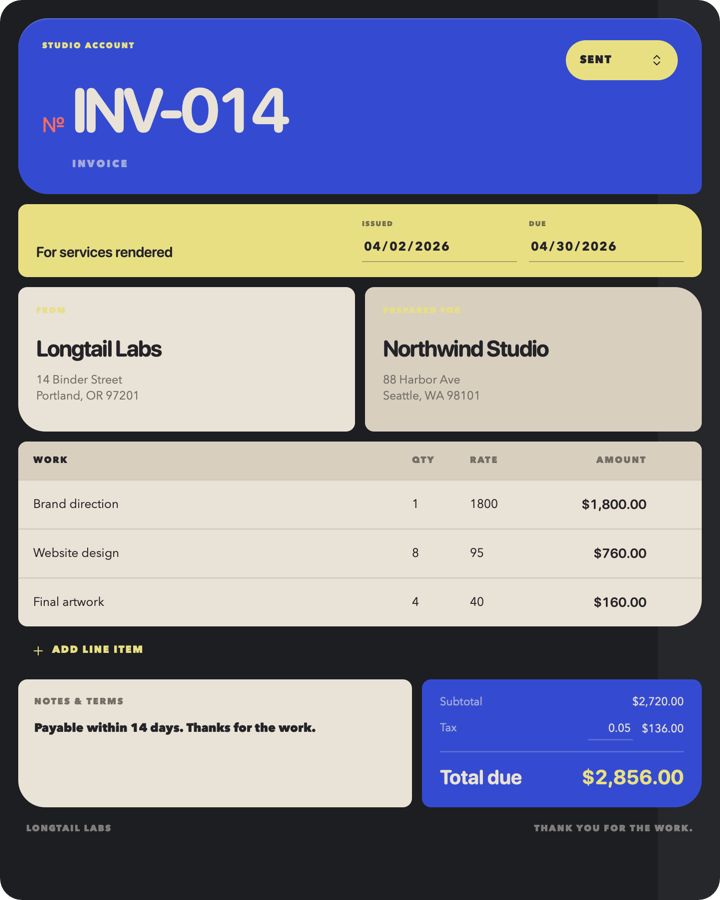
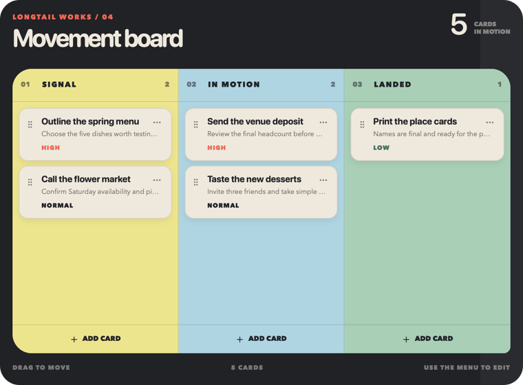
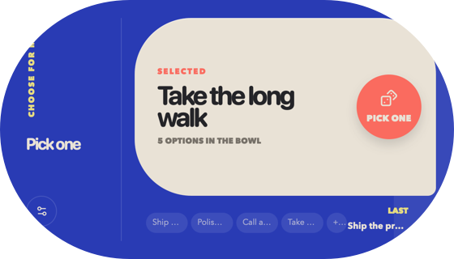

# hitSlop

> Tiny apps. Big ideas. Your data stays yours.

hitSlop is a native home for small, personal, local-first web apps. Each
`.slop` is a document you can open, move, duplicate, and keep—not an account
you have to maintain. The app owns its interface; the host owns durable JSON,
SQLite, named media, previews, export, and native window behavior.

<p align="center">
  
  
  
  
</p>

A slop can feel like **paper** (invoice, recipe, résumé), an **instrument**
(timer, picker, mixer), or a **skin** (a tiny object with its own silhouette).
Those are design directions, not runtime frameworks: the package contract is
plain HTML plus host data.

## Make one

Bun and the Svelte template are the supported v1 authoring path:

```sh
bunx @hitslop/cli init my-tiny-app
cd my-tiny-app
bun install
bun run dev
bun run build
bun run install
# when it is ready for the public catalog:
bun run publish
```

The CLI scaffolds a source project, previews it against isolated local stores,
and builds a source-free `dist/<slug>.slop`. The repository also includes a
React SDK and a maintained React example, but the v1 CLI does not scaffold
React projects yet.

Read [Authoring a slop](docs/authoring.md) for the full workflow and
[Designing tiny software](docs/presentation.md) for object families,
transparent backgrounds, resizing, cover/icon art, and export-safe layouts.

## What is inside a `.slop`?

```text
tiny-app.slop/
├── manifest.json
├── app.html
├── assets/                    optional, immutable
├── stores/                    optional, host-owned document data
│   ├── data.json
│   ├── data.sqlite
│   └── media/
└── QuickLook/
    ├── Preview.png
    └── Thumbnail.png
```

Authored templates and published artifacts never contain source, dependencies,
build caches, seed stores, editable stylesheets, SQLite sidecars, or Finder's
local `Icon\r` metadata. Storage is implicit: use JSON, SQLite, named media,
any combination, or none. See [Package format](docs/package-format.md) and
[Storage](docs/storage.md).

## The system at a glance

- `apps/apple` — the macOS/iOS document host, catalog UI, Quick Look, export,
  local/iCloud coordination, and the native capture CLI.
- `apps/catalog` — the public TanStack Start site and hardened Cloudflare R2
  publish/download gateway.
- `apps/registry` — Convex metadata for publishers, templates, releases, and
  aggregate creation counts.
- `packages/cli` — create, validate, preview, build, install, sign, and publish.
- `packages/runtime` — the framework-neutral browser bridge.
- `packages/svelte` and `packages/react` — reactive adapters.
- `packages/schema` — authoritative Zod schemas and generated Swift/JSON
  boundaries.
- `examples/slops` — maintained source examples; `archive/templates` is
  inventoried prior art, never a runtime package.

The hosted catalog is the convenient default. The protocol and services are
open, and [self-hosting](docs/self-hosting.md) is documented.

## Work on hitSlop

```sh
bun install
bun run release:check
```

That release gate checks generated schemas, TypeScript/Svelte, tests, builds,
package contents, documentation links, tracked-file hygiene, and the Swift
package. If you are changing Zod, run `bun run schema:generate` first.

Start with the [documentation map](docs/README.md), then read
[Architecture](docs/architecture.md), [Repository guide](docs/repository.md),
and [Contributing](CONTRIBUTING.md).

The macOS app is at `1.0.0`. The iOS app and public npm packages are at
`0.1.0` while their APIs settle.

## License

MIT © 2026 hitSlop contributors. See [LICENSE](LICENSE) and
[third-party notices](THIRD_PARTY_NOTICES.md).
